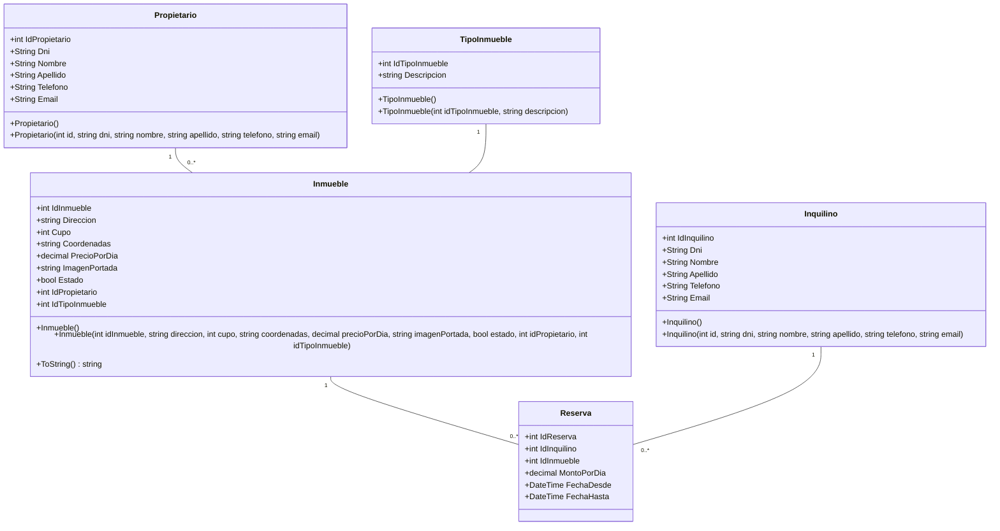

# ProyectoInmobiliaria
# Sistema de Gestión Inmobiliaria

> Aplicación web desarrollada en ASP.NET Core MVC para la administración integral de propiedades, propietarios e inquilinos con persistencia en MySQL.

---

## Integrantes del Grupo

* **Ortiz Paez Lourdes**
* **Silva Fabricio**

---

## Tecnologías Utilizadas

* **Lenguaje:** C# (.NET 10.0)
* **Framework Web:** ASP.NET Core MVC
* **Base de Datos:** MySQL (`MySql.Data`)
* **Front-end:** Razor Views, HTML5, CSS3, Bootstrap 5

---

## Instrucciones para Levantar la Base de Datos

Para inicializar la base de datos en tu entorno local de MySQL, ejecutá el script script_inmobiliaria.sql incluido en este repositorio siguiendo estos pasos:

## Desde MySQL Workbench / DBeaver: 

Abrí tu gestor de base de datos (MySQL Workbench, DBeaver, HeidiSQL, etc.).

Conéctate a tu servidor local de MySQL.

Abrí el archivo script_inmobiliaria.sql (File -> Open Script).

Ejecutá todo el script para crear la base de datos inmobiliaria y sus tablas correspondientes.


## Desde la Terminal (CMD / PowerShell): 

Abrí la terminal en la carpeta donde tenés el archivo .sql.

Ejecutá el siguiente comando reemplazando root por tu usuario de MySQL:

Bash
mysql -u root -p < script_inmobiliaria.sql
Ingresá tu contraseña de MySQL cuando la consola lo solicite.

---

## Configuración y Ejecución (.NET Core)

1. Abrí la solución `ProyectoInmobiliaria.sln` en Visual Studio.
2. Si las credenciales de tu servidor MySQL local son distintas, actualizá la variable `cadenaConexion` dentro del archivo `Program.cs`:
```csharp
string cadenaConexion = "Server=localhost;Database=inmobiliaria;Uid=root;Pwd=admin;";
```
---

## Estructura del Proyecto

ProyectoInmobiliaria
│
├── Controllers/
│   ├── InquilinosController.cs
│   ├── PropietariosController.cs
│   ├── InmuebleController.cs
│   ├── TipoInmueblesController.cs
│   └── ReservasController.cs
│
├── models/
│   ├── Inquilino.cs
│   ├── Propietario.cs
│   ├── Inmueble.cs
│   ├── TipoInmueble.cs
│   └── Reserva.cs
│
├── Repository/
│   ├── InquilinoRepository.cs
│   ├── PropietarioRepository.cs
│   ├── InmuebleRepository.cs
│   ├── TipoInmuebleRepository.cs
│   └── ReservaRepository.cs
│
├── Views/
│   ├── Home/
│   ├── Inquilinos/           # Index, Create, Edit, Delete
│   ├── Propietarios/         # Index, Create, Edit, Delete
│   ├── Inmueble/             # Index, Create, Edit, Details, Delete
│   ├── TipoInmuebles/        # Index, Create, Edit, Details, Delete
│   ├── Reservas/             # Index, Create, Edit, Details, Delete
│   └── Shared/               # _Layout.cshtml, _ValidationScriptsPartial.cshtml
│
└── Program.cs

## Diagrama de Clases

